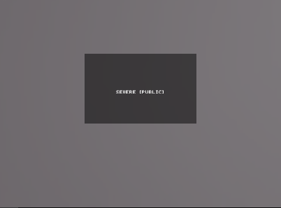

# Watermark

<figure><figcaption><p>ugly ass watermark</p></figcaption></figure>


I'm using imaginary text Size calculation because we do not have actual one yet.



```lua
local screen = getscreendimensions()
local imaginary_text_measure = {x = 15, y = 45}


local wx, wy = screen.x / 2 - imaginary_text_measure.x * 2 / 2, screen.y / 1.20

local screen = getscreendimensions()
local textString = "Severe [Public]"
local text = Drawing.new("Text")
text.Text = textString
text.Visible = true
text.Center = true
text.Color = {255, 255, 255}
text.Size = 10
text.Font = 4

local imaginary_text_measure = {x = 10 * string.len(textString), y = 10 * 9} 


local centerX = screen.x / 2
local centerY = screen.y / 1.20


local padding = 5
local textWidth = imaginary_text_measure.x
local textHeight = imaginary_text_measure.y


local rect = Drawing.new("Quad")
rect.Visible = true
rect.zIndex = 1
rect.Color = {0, 0, 0}
rect.PointA = {centerX - textWidth/2 - padding, centerY - textHeight/2 - padding}
rect.PointB = {centerX + textWidth/2 + padding, centerY - textHeight/2 - padding}
rect.PointC = {centerX + textWidth/2 + padding, centerY + textHeight/2 + padding}
rect.PointD = {centerX - textWidth/2 - padding, centerY + textHeight/2 + padding}
rect.Filled = true
rect.Transparency = 0.5

text.Position = {centerX, centerY}
text.zIndex = 2
```

