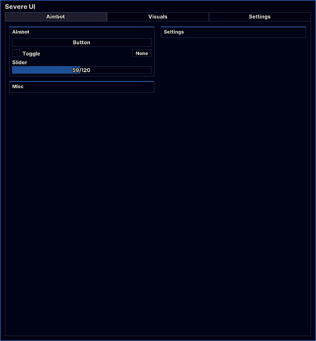

# kingbob


This is currently a WIP (Work in Progress) beta version\
Expects bugs, issues


<figure><figcaption><p>UI</p></figcaption></figure>

## Initialization


The link might be outdated



```lua
local Library = loadstring(game:HttpGet("https://raw.githubusercontent.com/DCHARLESAKAMRGREEN/Severe-Luas/refs/heads/main/Severe%20UI%20Library.lua"))()
```


## Create

```lua
Library:Create({
    Name = "UI Name"
})
```

Creates a new UI window with the specified name.

Parameters:

* **Name** <kbd><mark style="color:yellow;">**string**<mark style="color:yellow;"></kbd>: The name/title of the UI window

## Unload

```lua
Library:Unload()
```

Unloads/destroys the UI.

## Elements

### Tab

```lua
UI:Tab({
    Name = "Tab Name"
})
```

Creates a new tab in the UI.

Parameters:

* **Name** <kbd><mark style="color:yellow;">**string**<mark style="color:yellow;"></kbd>: The name of the tab

### Tab Methods

#### Section

```lua
Tab:Section({
    Name = "Section Name",
    Side = "Left" -- or "Right"
})
```

Creates a section within a tab.

Parameters:

* **Name** <kbd><mark style="color:yellow;">**string**<mark style="color:yellow;"></kbd>: The name of the section
* **Side** <kbd><mark style="color:yellow;">**string**<mark style="color:yellow;"></kbd>: The side to place the section on <kbd>**Left**</kbd> _or_ <kbd>**Right**</kbd>

Returns: `Section` object

### Section Methods

#### Button

```lua
Section:Button({
    Name = "Button Name",
    Tooltip = "Button description",
    Callback = function()
        -- Code to execute when button is clicked
    end
})
```

Creates a clickable button in a section.

Parameters:

* **Name** <kbd><mark style="color:yellow;">**string**<mark style="color:yellow;"></kbd>: The label for the button
* **Tooltip** <kbd><mark style="color:yellow;">**string**<mark style="color:yellow;"></kbd>: The description/tooltip text for the button
* **Callback** <kbd><mark style="color:red;">**function**<mark style="color:red;"></kbd>: Function to execute when button is clicked

#### Toggle

```lua
Section:Toggle({
    Name = "Toggle Name",
    Default = false,
    Tooltip = "Toggle description",
    Callback = function(state)
        -- Code to execute when toggle state changes
    end
})
```

Creates a toggle switch in a section.

Parameters:

* **Name** <kbd><mark style="color:yellow;">**string**<mark style="color:yellow;"></kbd>: The label for the toggle
* **Default** <kbd><mark style="color:orange;">**boolean**<mark style="color:orange;"></kbd>: Initial state of the toggle (true/false)
* **Tooltip** <kbd><mark style="color:yellow;">**string**<mark style="color:yellow;"></kbd>: The description/tooltip text for the toggle
* **Callback** <kbd><mark style="color:red;">**function**<mark style="color:red;"></kbd>: Function to execute when toggle state changes, receives state (<kbd><mark style="color:orange;">**boolean**<mark style="color:orange;"></kbd>) as parameter

#### Slider

```lua
Section:Slider({
    Name = "Slider Name",
    Min = 0,
    Max = 100,
    Default = 50,
    Units = "/100",
    Increment = 1,
    Tooltip = "Slider description",
    Callback = function(value)
        -- Code to execute when slider value changes
    end
})
```

Creates a slider in a section.

Parameters:

* **Name** <kbd><mark style="color:yellow;">**string**<mark style="color:yellow;"></kbd>: The label for the slider
* **Min** <kbd><mark style="color:blue;">**number**<mark style="color:blue;"></kbd>: Minimum value of the slider
* **Max** <kbd><mark style="color:blue;">**number**<mark style="color:blue;"></kbd>: Maximum value of the slider
* **Default** <kbd><mark style="color:blue;">**number**<mark style="color:blue;"></kbd>: Initial value of the slider
* **Units** <kbd><mark style="color:yellow;">**string**<mark style="color:yellow;"></kbd>: Text to display after the value
* **Increment** <kbd><mark style="color:blue;">**number**<mark style="color:blue;"></kbd>: Step size for the slider
* **Tooltip** <kbd><mark style="color:yellow;">**string**<mark style="color:yellow;"></kbd>: The description/tooltip text for the slider
* **Callback** <kbd><mark style="color:red;">**function**<mark style="color:red;"></kbd>: Function to execute when slider value changes, receives value (<kbd><mark style="color:blue;">**number**<mark style="color:blue;"></kbd>) as parameter

#### Dropdown

```lua
local Dropdown1 = Section1:Dropdown({
    Name = "Dropdown",
    Default = "Option 1",
    Tooltip = "Dropdown description",
    Options = {"Option 1", "Option 2", "Option 3"},
    Callback = function(Selected)
        -- Code to execute when selected option changed
    end
})
```

Creates a slider in a section.

Parameters:

* **Name** <kbd><mark style="color:yellow;">**string**<mark style="color:yellow;"></kbd><mark style="color:yellow;">**&#x20;**</mark><mark style="color:yellow;">**:**</mark> The label for the dropdown
* **Default** <kbd><mark style="color:yellow;">**string**<mark style="color:yellow;"></kbd>: Default value for the dropdown
* **Tooltip** <kbd><mark style="color:yellow;">**string**<mark style="color:yellow;"></kbd>: The description/tooltip text for the dropdown
* **Options&#x20;**<kbd><mark style="color:blue;">**array**<mark style="color:blue;"></kbd> <kbd><mark style="color:yellow;">**string**<mark style="color:yellow;"></kbd>: The array of options for the dropdown
* **Callback** <kbd><mark style="color:red;">**function**<mark style="color:red;"></kbd>: Function to execute when selected option changes, receives selected option (<kbd><mark style="color:yellow;">**string**<mark style="color:yellow;"></kbd>) as parameter

### Toggle Methods

#### Keybind

```lua
Toggle:Keybind({
    Default = "None",
    Callback = function(state)
        -- Code to execute when keybind is pressed
    end
})
```

Adds a keybind to a toggle.

Parameters:

* **Default** <kbd><mark style="color:yellow;">**string**<mark style="color:yellow;"></kbd>: Default key for the keybind
* **Callback** <kbd><mark style="color:red;">**function**<mark style="color:red;"></kbd>: Function to execute when keybind is triggered, receives state (<kbd><mark style="color:yellow;">**string**<mark style="color:yellow;"></kbd>) as parameter
